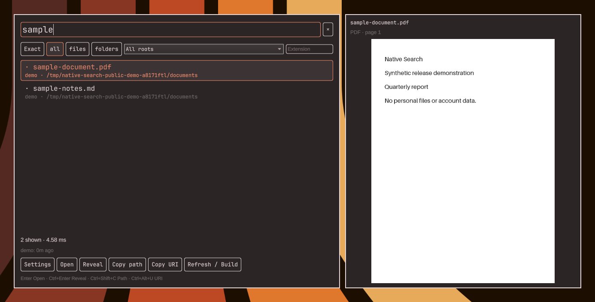

# Native Search for Omarchy

An optional, local file finder for Omarchy's Quickshell desktop. A centered input expands downward as you type; a panel on the right previews the selected document.

[Download the preview](https://github.com/not-that-nda/omarchy-native-search/releases) · [Install](#install) · [Request / vote on features](https://github.com/not-that-nda/omarchy-native-search/discussions/categories/ideas) · [Ask a question](https://github.com/not-that-nda/omarchy-native-search/discussions/categories/q-a) · [Report a bug](https://github.com/not-that-nda/omarchy-native-search/issues/new/choose) · [Roadmap](ROADMAP.md)

**Preview release.** This is an independent community plugin, not an official Omarchy component. Filename indexes are snapshots, not real-time filesystem watches. Public packaging is tested in isolated user profiles; see `RELEASE.json` for artifact identity and release notes for acceptance limits.

## Screenshots

### Compact search


### Results and document preview



Screenshots use synthetic documents on an empty workspace, cropped tightly around the interface with a small wallpaper margin. The desktop status bar is excluded and image metadata is stripped. No video has been recorded.

## Features

- Indexed filename/path search with per-user plocate databases.
- Exact multi-term matching or fuzzy subsequence/typo matching.
- File/folder, extension and root filters; bounded results clearly marked when partial.
- Open, reveal, copy path and file URI actions.
- PDF first-page, image, text/code and DOCX/ODT text previews.
- Normal settings controls at the bottom; optional validated JSON editor.
- Explicit scope/freshness, low-priority refresh jobs and reversible installation.

## Requirements

Omarchy's Quickshell plugin shell with version-1 `shell.json`, user plugin discovery, `omarchy-shell` IPC, `qs.Commons`, and Hyprland Lua bindings. The original integration was exercised with Omarchy 4.0.4-1, Quickshell 0.3.1 and plocate 1.1.25. Other API versions need verification; traditional Walker-only Omarchy installations are not supported by this plugin.

Python 3.10+, plocate/updatedb, systemd user services, findmnt, nice/ionice, wl-copy, xdg-open, gdbus, Quickshell, omarchy-shell and omarchy-hyprland-session-locked. Optional preview dependencies: `poppler` (`pdftoppm`) and `python-pillow`. Missing preview tools do not prevent filename searching. Dependencies are system packages, not bundled code.

## Install

Download and extract the release tarball; verify its SHA256SUMS against the published release. From its extracted directory, in an Omarchy graphical session:

```sh
./bin/omarchy-native-search plan
./bin/omarchy-native-search install
omarchy-native-search show
omarchy-native-search refresh
```

Ensure `~/.local/bin` is on PATH. Home is the initial scope. Installation does not start an initial full scan: `refresh` does. No default shortcut is taken from your desktop.

Optional explicit roots and an unused shortcut on first installation:

```sh
./bin/omarchy-native-search install --root "$HOME" --root /mnt/documents --shortcut SUPER+CTRL+F
```

Occupied shortcuts are refused, never silently replaced. Change or remove the managed binding with `update --shortcut ...` or `update --shortcut none`. Existing roots are preserved during upgrades. To replace their list explicitly:

```sh
omarchy-native-search configure --root "$HOME" --root /mnt/documents
omarchy-native-search refresh
```

The installer registers only this plugin and its owned binding block/timer, retaining unrelated configuration. It reloads plugin/config registration without restarting the compositor or applications. Installed CLI/payload are self-contained: the extracted download is not needed after installation.

## Use

Type a name or path, select with Up/Down or click, Enter to open, Ctrl+Enter to reveal, Ctrl+Shift+C to copy the path, Ctrl+Alt+U to copy a URI, Escape to close. Ctrl+, opens settings even from the collapsed input.

Exact/Fuzzy switches matching for the current query; settings choose the default and typo tolerance. All words must match. Fuzzy candidate caps may omit matches for broad queries; “partial” does not mean a complete global ranking. Previews follow selection and never persist document content. PDF previews show page one; office previews are text only. The panel hides when insufficient space remains on the right.

Settings include limits, refresh interval, existing-root toggles and exclusions. Advanced JSON is validated before atomic save. Root/exclusion changes require refresh. Missing mounts, failed refreshes and old snapshots have explicit status.

## Update and remove

Extract a newer release and run its `./bin/omarchy-native-search update`. Downloading/publishing a release never automatically mutates your desktop. Install/update is idempotent and refuses externally modified owned files. `omarchy-native-search doctor` checks installation, roots and the timer.

```sh
omarchy-native-search status
omarchy-native-search remove
```

Removal unregisters the owned plugin/binding/timer, preserving other settings. Private config, indexes and original backups remain for reinstall; inspect them before any explicit purge. To roll back code, run a previously downloaded release's installer; newer incompatible settings require the documented migration rather than blindly overwriting preferences.

Runtime ownership retains the original component namespace: plugin `nda.native-search`, config `~/.config/nda-omarchy-stack/native-search`, data/state under the corresponding XDG `nda-omarchy-stack/native-search` directories, timer `nda-native-search.timer`. An existing separately managed installation is refused rather than adopted.

## Limits and privacy

Only configured, mounted, readable roots are indexed; no privileged indexing or remote/cloud-only files. Default omissions include caches, trash, node_modules and .git directories. Indexes contain private filenames and are user-readable only. Queries, previews and auth credentials are not published or logged by default. There is no cloud/AI/telemetry dependency.

## Development

This is an optional community-maintained tool, not a proposal to include it in Omarchy's default installation. Please keep Native Search requests in this repository rather than filing them against Omarchy itself. Feature ideas are searchable and can be upvoted in Discussions; bugs go to Issues. Reports are reviewed in batches without a guaranteed response time. See [Support](SUPPORT.md) and [Contributing](CONTRIBUTING.md).

```sh
python3 -m unittest discover -s dev/tests -p 'test_*.py' -v
```

Backend tests use temporary real plocate indexes; package tests use isolated configuration homes and mocked desktop/service calls. These are not a substitute for graphical acceptance on each supported Omarchy release. See `CHANGELOG.md` and `PROPOSAL.md`.

MIT license, copyright NDA. This package uses Omarchy/Quickshell at runtime; it does not bundle their implementations. Poppler, Pillow and plocate retain their own licenses and are installed separately.
